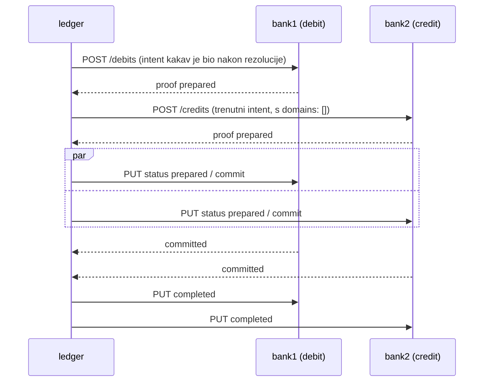

# Nastanak CLI e2e, L6, ruta i L8 — 2026-09-26, treća sesija

Nastavak [`2026-09-26-nastanak-l4-l5.md`](2026-09-26-nastanak-l4-l5.md). Ponašanje
reference je u [`FINDINGS.md`](../FINDINGS.md), protokol bridgea u
[`l5-bridge-protocol.md`](l5-bridge-protocol.md), plan u [`TODO.md`](../TODO.md).

## Brojke

| | početak | kraj |
| --- | --- | --- |
| Operacije | 71/146, 57 snimkom | **82/146, 60 snimkom** |
| Razine u `npm run check` | 10 | **13** (+ l6, routes, events) + `minka` CLI e2e |
| Testovi (memorija + Postgres) | 173 | **217** |
| `npm run check` | ~90 s | ~2,5 min |
| Novi ledgeri na sandboxu | — | 3 (l6, routes, events) |

## Što je napravljeno

1. **`minka` CLI end-to-end** (`scripts/cli-e2e.sh`, 19 koraka, dio checka). Pukle su
   četiri stvari, sve sad popravljene: `server connect` čita `GET /api/v2` (nije u specu);
   `ledger create` ne šalje token; prije svakog `create` CLI čita
   `GET /schemas?data.record=<vrsta>` i `GET /policies?data.record.$in[0]=…`. Otud resurs
   `schemas` (12 sistemskih po ledgeru) i pravi filteri lista (`query.ts`, about-queries).
2. **L6 — dva bridgea u jednom intentu.** Prepare ide u dvije faze (debiti, pa crediti
   kad su svi debiti pripremljeni); abort i statusne obavijesti samo dijelovima kojima
   je poslan prepare; `claims.groupBy` daje novi entry za grupu ≥ 2.
3. **Adrese i rute.** Hijerarhija `schema:handle@parent → schema@parent → parent →
   schema`; rute `credit`, `debit`, `accept`, `forward` (novi intent u istom threadu).
4. **L8 — isporuke eventa.** Svaki poziv bridgeu je `$evd` zapis (outbox), s proofom po
   pokušaju; 501 → `cancelled`; retry po handleu ili starosti.

## Metoda

Ista kao prije (scenarij kroz službeni SDK, snimka sandboxa, provjera našeg servera), s
dva dodatka:

- **Više bridgeova na jednom portu**, razlikovanih prefiksom putanje (`/bank1/v2`,
  `/bank2/v2`), iza **jednog** quick tunela (`startBridges` u `conformance/bridge.ts`).
- **Čitanje sandboxa izravno nakon snimke.** Ledgeri scenarija imaju pravilo
  `{any, any}`, pa se čitaju bez tokena. Tako je nađen intent `forward` rute (nije bio u
  zadnja tri u snimljenoj listi) i utvrđeno da je praćenje isporuka uključeno.

## Odluke

- **Isporuke su outbox.** Zapis `$evd` nastaje u istoj transakciji kao korak traila
  koji ga uzrokuje; `Bridges` ga isporučuje i potpisuje ishod svakog pokušaja. `resume`
  šalje neprihvaćene isporuke s nepromijenjenim `output`om. Redrive koji je poslije
  restarta ponovno računao pozive iz traila je uklonjen — bio je složeniji, a slao je
  drukčija tijela nego prvi put.
- **`Store.once`** — jedina oznaka izvan traila: da su crediti intenta poslani. Trail to
  ne može zapisati bez promjene onoga što klijent čita, a dva istodobna izvještaja
  debita inače pošalju credite dvaput.
- **Proslijeđeni intent (`forward`)** nosi `data.origin`; za njega se ne provjeravaju
  dozvole (ledger ga je sam napravio) i core ne sudjeluje (snimljeno: nema rezervacije).
- **`parent: ""` na balance redu** postavlja se na svakom ažuriranju postojećeg reda, ne
  samo kod rezervacije — jedino pravilo koje odgovara svim snimkama.
- **Komparator** poredak koji ovisi o vremenu i na referenci svodi na kanonski:
  susjedni izvještaji više bridgeova s istim statusom, i liste isporuka (status i
  commit nastaju istodobno).

## Zamke

1. **Postgres i `resume` između runova.** l6 namjerno ostavlja intent zauvijek
   `committed`; sljedeći server na istoj bazi ga je redriveao prema bridgeu idućeg
   scenarija na istom portu, i l5 je pao s pozivima iz l6. Sad svaki Postgres run dobiva
   praznu bazu (`scripts/dev-db.sh fresh <ime>`).
2. **Test utrke koji ne hvata utrku.** Test „dva izvještaja odjednom” prolazio je i bez
   `once` — prozor je preuzak. Zamijenjen determinističkim: nakon slanja credita još dva
   prolaza `core.process` ne smiju ništa poslati. Provjereno mutacijom.
3. **Test bez `finally`** (restart u l5) nakon promjene semantike nije zatvarao servere,
   pa je `npm test` visio bez izlaza. Pokretanje fajl po fajl s `timeout` ga je našlo.
4. **CLI `signer list`** pokazuje lokalne signere; ledgerove daje `--remote`.
5. **`GET /schemas` sandboxa** vraća sheme istim redom kao policy liste (najnovije prve),
   pa se sistemske sheme upisuju obrnutim redom.

## Gdje smo: koliko je gotovo i za što je uporabljivo (2026-09-28)

| Mjera | Stanje |
| --- | --- |
| Operacije API-ja | 82/146 (56 %), od toga 60 potvrđeno snimkom (41 %) |
| Ljestvica L0–L9 | L0–L6 gotovo; rute gotove; L7 djelomično (istek, bez aborta threada); L8 za bridgeove (bez effecta); L9 ništa |
| Resursi s 0 operacija | anchors, domains, effects, reports, oauth, system |

Procjena: jezgra kretanja novca (ono po čemu je ledger ledger) je oko dvije trećine
gotova; cijela površina API-ja nešto iznad pola.

**Uporabljivo danas** — kao lokalna zamjena za Minku u razvoju i CI-ju aplikacija koje
govore `@minka/ledger-sdk` ili `minka` CLI: ledgeri, simboli, walleti, intenti (issue,
transfer, destroy, limit), salda i rezervacije, limiti, signeri, circles, pravila
pristupa, status policy, bridgeovi s 2PC-om (i više banaka u jednom intentu), adrese i
rute, isporuke prema bridgeovima s retryjem. Ponašanje je potvrđeno usporedbom sa
sandboxom, ne pretpostavljeno.

**Nije uporabljivo za produkciju:**

- bridge `secure` (header, oauth2) nije implementiran — prava banka s autentikacijom
  se ne može spojiti;
- nema effecta (webhooka), anchora, domena, reporta, access policyja, korisničkih shema,
  aborta threada, provjere `hsh` claima;
- ključevi ledgera stoje u bazi nešifrirani; nema HA, backupa, nadzora ni sigurnosnog
  pregleda; obrada serijalizira cijeli ledger;
- licenca, AML/KYC i pristup shemama plaćanja su izvan opsega (non-goal iz README-a).

## Otvoreno (detalji u TODO.md)

- Snimiti CLI tok na sandboxu kao conformance razinu (`GET /api/v2` bi bio divergencija).
- Korisničke sheme koje validiraju zapise.
- L6: kasni izvještaj nakon aborta, pad debita dok drugi debit još čeka.
- Rute: dubina > 3, ciklus debita, neuspjeli `forward` (abort threada — L7).
- L8: effecti (signali, webhooki) i njihove isporuke; `delivery.target-unreachable`.

## Vezani dokumenti

- Nastavak: [`2026-10-02-nastanak-l7-i-dalje.md`](2026-10-02-nastanak-l7-i-dalje.md) — L7, bridge `secure`, nova tablica „Gdje smo“.
