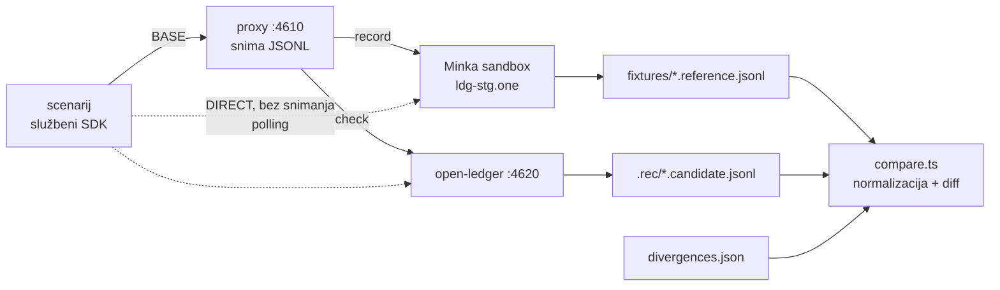

# Nastanak L0–L4 — 2026-09-26

Kako je u jednoj sesiji nastao Minka-kompatibilni ledger do 58 od 146 operacija, i što
bi sljedeći prolaz inače morao ponovno otkriti. Ponašanje reference je u
[`FINDINGS.md`](../FINDINGS.md), plan u [`TODO.md`](../TODO.md), pokrivenost u
[`COVERAGE.md`](../COVERAGE.md). Ovdje su metoda, brojke i zamke.

## Metoda

- Scenarij pokreće **službeni `@minka/ledger-sdk`**, pa su zahtjevi točno oni koje šalje
  pravi klijent. Snima se jednom protiv sandboxa; provjera se vrti lokalno koliko god.
- Polling (čekanje da intent završi) ide **mimo proxyja** (`DIRECT`), inače bi broj
  snimljenih razmjena ovisio o vremenu i usporedba bi bila nestabilna.
- Normalizacija zamjenjuje vremena, luidove, ključeve, hasheve, potpise, threadove,
  `deb_/cre_` stavke i `{{ secret.… }}` placeholderima numeriranima po prvom pojavljivanju,
  tako da se identitet i dalje provjerava. `detail` greške je meka razlika, `custom.trace`
  (Minkini stack traceovi) se ignorira.
- Kad je referenca očito neispravna, odgovaramo drugačije **namjerno** i to upisujemo u
  `conformance/divergences.json` s razlogom. Trenutno dva: `maxBalance` koji ostavlja intent
  zauvijek `committed`, i sandboxovo serversko pravilo `{any, wallet}`.

## Brojke na kraju sesije

| | |
| --- | --- |
| Operacije | 58/146 implementirano, 26 potvrđeno snimkom |
| Snimke | l0 18/18 · l1 30/30 · l3 39/41 (+2 namjerno) · records 22/23 (+1) · access 35/35 · access3 15/16 |
| Nisu uspoređene | access2, access4 (snimljene, vidi TODO NEXT) |
| Testovi | 49 u memoriji, ~80 s `DATABASE_URL` (memorija + Postgres) |
| Ledgeri ostavljeni na sandboxu | ~12 `open-ledger-conf-*`, ne mogu se obrisati |

## Odluke

- **TypeScript do kraja** (korisnik, 2026-09-26) — poništava raniji plan "Rust od L5".
- **Obrada intenta u jednoj transakciji po ledgeru** (mutex u memoriji, `pg_advisory_xact_lock`
  u Postgresu). Referenca prolazi kroz vidljiva međustanja; mi upisujemo cijeli proof trail
  odjednom, pa se salda nikad ne vide napola pomaknuta, a pad ostavlja intent `pending` za
  `Core.resume()`. Grubo, ali ispravno; per-wallet lock je optimizacija u TODO-u.
- **Validacija Ajv-om sa shemama iste strukture kao Minkine** — `custom.errors` uspoređuje
  se strogo, a redoslijed `allOf`/`required` određuje koja greška ide prva. Sheme su pisane
  iz ponašanja, Minkin spec se ne kopira u repo.

### Odbačeno

- **Kopirati sandboxovo serversko pravilo `{action: any, record: wallet}`** — prošlo bi 23/23
  u `records`, ali bi svaki wallet bio svima upisiv. Serverska pravila su konfigurabilna
  (`buildApp({ serverRules })`) za tko želi sandbox-ponašanje.
- **Reproducirati `maxBalance` koji zaglavi intent** — intent koji nikad ne završi nije ugovor.
- **Pogađati semantiku pristupa iz docsa** — prvi model ("signer pravila samo za mutacije",
  "registracija signera odlučuje") bio je dvaput pogrešan; tek četiri snimke (access,
  access2–4) dale su model koji objašnjava sva opažanja: doseg pravila bez `record` i gate
  `access` na ledgeru.

## Zamke koje su koštale vremena

1. **`hsh` claim veže token uz apsolutni URL.** SDK ga po defaultu šalje; kroz proxy (drugi
   host) sandbox vraća `401 Invalid token.`. Scenariji zato šalju `createHsh: false`.
   Potvrđeno slanjem istog zahtjeva izravno.
2. **SDK čita `exp` kao trajanje u sekundama**, ne epohu; epoha daje token koji ističe za 56 godina.
3. **Ledger bez `config` na sandboxu ne može pomaknuti novac** — svaki commit pada s
   `core.unexpected-error`. Prva L1 snimka je zato izgledala kao da issue ne radi. CLI uvijek
   šalje config; scenariji od L1 isto.
4. **`POST /ledgers` je odgovarao prije upisa ključeva signera.** Sljedeći zahtjev klijenta
   nalazio je ledger bez ključa. U memoriji nikad nije puklo; u Postgresu redovito. Popravak:
   `create()` ne šalje odgovor, ruta ga šalje tek nakon svih upisa.
5. **Snimanje i provjera istodobno** dijele portove 4610/4620 i kvare jedno drugo — "Node.js"
   u zadnjem retku loga je taj slučaj, ne regresija.
6. **Scenariji access2/access4 čekaju do 200–240 s** kad intent nikad ne završi ili je čitanje
   zabranjeno; provjera protiv našeg servera zato traje dugo. Popraviti prije uključivanja u
   `npm run check`.
7. **`Write` odbija fajl koji je u međuvremenu mijenjan skriptom** — prije potpunog prepisivanja
   `app.ts` treba ga ponovno pročitati.

## Vezani dokumenti

- [`2026-09-26-nastanak-l4-l5.md`](2026-09-26-nastanak-l4-l5.md) — nastavak: L4 dovršetak, L5 kroz tunel, L7 istek

- [`../../docs.minka.io/ssot/2026-09-26-upstream-refresh-and-minka-ds.md`](../../docs.minka.io/ssot/2026-09-26-upstream-refresh-and-minka-ds.md) — iteracija mirrora iste večeri
- [`../../docs.minka.io/ssot/2026-08-08-state-machine-model.md`](../../docs.minka.io/ssot/2026-08-08-state-machine-model.md) — ljestvica L0–L9 i izvorni plan
