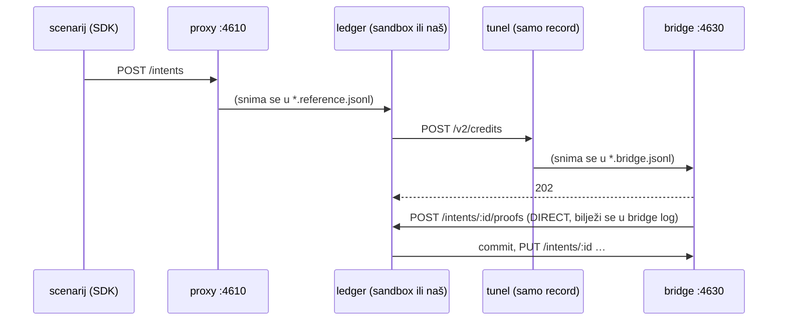

# Nastanak L4 (dovršetak), L5 i L7 isteka — 2026-09-26, druga sesija

Nastavak [`2026-09-26-nastanak-l0-l4.md`](2026-09-26-nastanak-l0-l4.md). Ponašanje
reference je u [`FINDINGS.md`](../FINDINGS.md), protokol bridgea u
[`l5-bridge-protocol.md`](l5-bridge-protocol.md), plan u [`TODO.md`](../TODO.md). Ovdje su
metoda, brojke, odluke i zamke koje se ne vide iz koda.

## Brojke

| | početak | kraj |
| --- | --- | --- |
| Operacije | 58/146, 26 snimkom | **71/146, 57 snimkom** |
| Razine u `npm run check` | l0 l1 l3 records access access3 | + access2, access4, records2, **l5** (10) |
| Testovi (memorija + Postgres) | 98 | **173** |
| `npm run check` | >4 min (access2/4 čekali po 240 s) | ~90 s |
| Novi ledgeri na sandboxu | — | 3 (records2, l5 ×2) |

Repo je sada i na GitHubu: `stepanic/open-ledger` (tada privatno; od 2026-10-08 javno kao `pinkainc/open-ledger`), isto `stepanic/docs.minka.io`.

## Metoda: snimanje 2PC-a kroz tunel

Docs su izgledali kao jedini izvor za bridgeove, jer sandbox zove banku izvana. Nisu:
scenarij pokreće **vlastiti bridge** (`conformance/bridge.ts`), a sandbox ga dosegne
kroz **cloudflared quick tunnel** koji `run.sh` otvori kad scenarij sadrži `needs-bridge`.

- Bridge log se uspoređuje u **kanonskom poretku** (po intentu, pa po fazi), jer se
  statusne obavijesti i proofovi utrkuju s pozivima.
- Proofovi bridgea idu mimo proxyja (DIRECT), inače bi redoslijed klijentskih razmjena
  ovisio o vremenu.
- Snimka je dala 21/21 + 24/24 odmah nakon implementacije; komparator je provjeren
  namjernom mutacijom kandidata (hvata razliku duboko u snimci intenta).

## Odluke

- **Trail je jedino stanje intenta.** `Core.process` čita što je intent već prošao iz
  proofova i radi sljedeći korak; poziva se na svaki izvještaj bridgea i nakon restarta
  (`resume` ponovno šalje pozive u letu). Nema tablice stanja koja bi se mogla razići.
- **`$ben` luid entryja izveden je hashem** (ledger + handle entryja), pa je retry nakon
  pada isti poziv — bridge ga tretira kao no-op.
- **Status intenta mijenja samo core.** Proof na intentu se samo dodaje. Pronađeno
  testom idempotencije: drugi `committed` bridgea, kroz generički `applyStatus` i
  sistemsku policy `intent:status` (quorum `system`, „zadovoljen” ranijim sistemskim
  proofom), vraćao je `completed` intent u `committed` i završavao ga dvaput.
- **`OPEN_LEDGER_MINUTE_MS`** skraćuje minutu isteka samo u conformance runovima
  (run.sh: 1000 ms), da snimljeni jednominutni istek ne traje minutu.
- **`conformance/pending.json`** — snimljeno, a još neimplementirano ponašanje se u
  checku preskače s razlogom, ne skriva. Trenutno prazno.

### Odbačeno

- **Namjerno odstupanje „sandboxovo serversko pravilo `{any, wallet}`”** — bilo je
  kriva interpretacija. Access check prikazuje pravila bez `signer`, a pravilo na
  razini zapisa dobiva `record: <vrsta>`; to je bilo aliceino vlastito pravilo.
  Odstupanje obrisano, `records` 23/23.
- **Ponovno pokretanje intenta na svaki dodatni potpis** — referenca to ne radi
  (records2: vlasnikov potpis nije pokrenuo intent koji čeka `spend`).

## Zamke

1. **Fixture access4 bio je zagađen** s 36 razmjena istodobnog l0/l1 runa kroz isti
   proxy. `run.sh` sada odbija zauzete portove (4610/4620/4630), čeka da se oslobode, a
   pri snimanju zadržava samo razmjene ledgera `open-ledger-conf-<run>`
   (`conformance/own-ledger.ts`).
2. **`set -euo pipefail` + `grep` bez pogotka** u petlji čekanja na URL tunela prekida
   skriptu; treba `|| true`.
3. **Bridge bez `schema`** pada na sandboxu (`There are schemas defined for record of
   type bridge…`) — svaki ledger ima 12 sistemskih shema, za bridge `rest`
   (`reference-system-schemas.json`). Prva l5 snimka je zbog toga potrošena.
4. **Port se oslobađa sa zakašnjenjem** nakon `kill` — nova zaštita ga je prvo
   prijavila kao „drugi run”; `cleanup` sada čeka zatvaranje.
5. **`books(undefined)`** u testu uzme default parametar — za „bez configa” koristi se `null`.

## Otvoreno (detalji u TODO.md)

- L6: više participanata u intentu, timeouti, padovi usred 2PC-a.
- Bridge: `secure` (treba secret store), `traits`, redoslijed aborta i `groupBy` s više
  entryja istog bridgea, autorizacija izvještaja.
- Što pokreće intent koji čeka potpis (probati proof s `custom.status`).
- `wallet.routes`, adrese `schema:handle@parent`; L8 eventi; resursi anchors, domains,
  reports, schemas, oauth.
- End-to-end provjera s `minka` CLI-jem protiv našeg servera nije napravljena.

## Vezani dokumenti

- [`2026-09-26-nastanak-l0-l4.md`](2026-09-26-nastanak-l0-l4.md) — prva sesija
- [`l5-bridge-protocol.md`](l5-bridge-protocol.md) — protokol iz docsa i bridge-sdk-a, s odgovorima snimke
- [`2026-09-26-nastanak-e2e-l6-l8.md`](2026-09-26-nastanak-e2e-l6-l8.md) — nastavak: CLI e2e, L6, rute, L8
