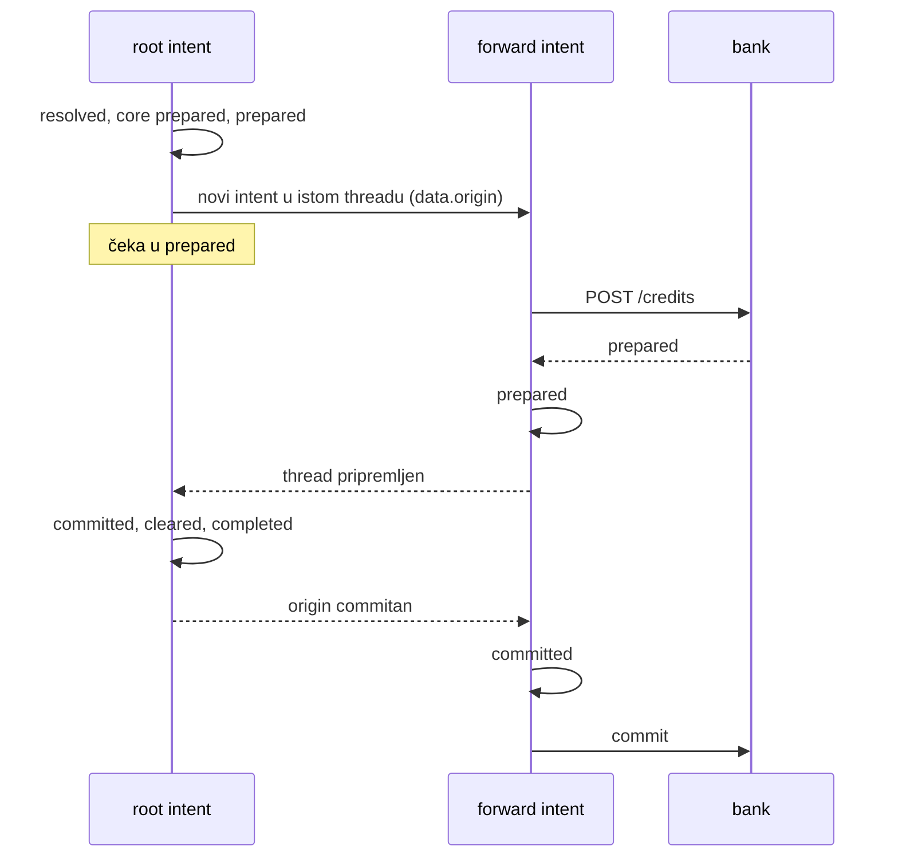

# Nastanak L7 i dalje — 2026-10-02, četvrta sesija

Nastavak [`2026-09-26-nastanak-e2e-l6-l8.md`](2026-09-26-nastanak-e2e-l6-l8.md).
Ponašanje reference je u [`FINDINGS.md`](../FINDINGS.md), plan u [`TODO.md`](../TODO.md).
Ovo je prva sesija vođena iz ovog repoa, a ne iz `../docs.minka.io`. Svaka razina
ima svoje poglavlje, a tablica „Gdje smo“ na kraju opisuje stanje nakon zadnje.

## L7 — threadovi, istek threada, ograničenje veličine

### Što je napravljeno

- **Thread se commita kao cjelina.** Intent koji je napravio `forward` čeka u
  `meta.status: prepared` (i s `routed`) dok svaki intent threada nije pripremljen.
  Root commita prvi, a svaki forward intent nakon intenta koji ga je napravio.
- **Thread i pada kao cjelina.** Kad jedan intent padne, ostali dobivaju isti
  `failed {reason, detail}`, zatim `aborted` i otpuštanje rezervacija (core `aborted`
  po unosu), abort bridgeova kojima je poslan prepare, i `rejected`. To vrijedi za
  odbijen forward, za bridge koji odbije prepare i za istek.
- **Popravak koji je otkrila snimka:** forward intent s bridgeanim dijelom slao je
  prepare iznova na svaki izvještaj. Marker „prepare je krenuo“ bili su core proofovi,
  a forward intent ih nema. Sad ga zamjenjuje oznaka (`Store.once`, novi `Store.marked`).
- **Debit forward intenta ne provjerava saldo.** Troši kredit svog threada koji je
  pripremljen, ali još nije commitan. Wallet je u tom trenutku prazan, a referenca ga
  propušta.
- Scenarij `l7` (33/36 i 12/15, ostatak su namjerne razlike), 5 unit testova u
  `server/test/l7.test.ts`.

### Metoda

Kao i prije, ali s jednim novim pravilom, naučenim na teži način: **prije snimanja
pitaj može li slučaj napraviti neograničen posao na referenci.** Prva snimka imala je
dva walleta koji si međusobno prosljeđuju. Referenca ograničenje od 10 intenata
provjerava tek kad je thread pripremljen, pa je u devet minuta napravila oko 5000
intenata na Minkinom stagingu. Petlju sam prekinuo izmjenom ruta tih dvaju walleta, što
je dopuštalo pravilo `{any, any}` testnog ledgera. Tek tada je referenca javila
`core.thread-size-exceeded`. Takvi slučajevi idu samo u unit testove (zapisano i u memory).

Ishod „tihog“ forwarda i petlje pročitan je izravno sa sandboxa (`curl`, bez proxyja).
U snimci je samo ograničena verzija.

### Odluke

- **Ograničenje veličine provjerava se pri prosljeđivanju.** Intent čiji bi forward
  napravio 11. intent u threadu pada s reasonom i detailom reference. Ovo je namjerno
  odstupanje, jer referenca petlju prvo pusti.
- **Istek forward intenta.** Referenca ga ne istekne ni nakon devet minuta, pa thread
  ostaje zauvijek s rezerviranim novcem. Mi ga isteknemo, a thread pada s
  `core.intent-expired`. Odstupanje je u `divergences.json` (l7 #25–27, bridge #12–14),
  jer dokumentacija kaže da istek abortira cijeli thread.
- **Thread se traži skeniranjem intenata ledgera,** ali samo za threadove s forwardom
  (oznaka `thread … forwarded`). Ostali intenti ne plaćaju ništa. Indeks po
  `meta.thread` je u TODO-u.
- **`routed` dok čeka:** uvijek. Referenca ga ima ili nema ovisno o utrci (dvije
  snimke, dva ishoda).

### Zamke

1. **Neograničen scenarij na referenci** (vidi Metoda). Ponovna snimka koštala je još
   dva ledgera na sandboxu.
2. **Slučaj koji kod nas istekne za sekundu, a na referenci nikad,** pomaknuo je sve
   iza sebe (bridge log, numeraciju coreId-a). Zato je premješten na kraj scenarija.
3. **Comparator:** id intenta upisan u tekst (`… for intent 04VC…`) i u URL statusnog
   PUT-a sad se normalizira. Razmjena koja postoji samo na jednoj strani može biti
   namjerna razlika. Izvještaji istog bridgea s istim statusom slažu se po mjestu unosa
   u trailu, a `core-N` testnog bridgea više nije identitet. Bez toga je `l6` na
   Postgresu pukao na utrci koju je otkrila sporija obrada.
4. **`settle` u scenariju koji `aborted` smatra konačnim** pročitao bi intent prije
   nego što bridge potvrdi abort. Polling ide mimo proxyja, pa popravak ne mijenja
   fixture.

## Bridge `secure`, retry cap, traits, `activate`

### Što je napravljeno

- **Secreti.** Vrijednost pravila u `secure` je referenca `{{ secret.<ime> }}`, a sama
  vrijednost stiže jednom, u `meta.secret`. Ledger je zapečati (AES-256-GCM, master
  ključ `OPEN_LEDGER_MASTER_KEY`, kontekst `ledger/bridge/handle/ime` kao AAD) i nikad
  je ne vraća. Referenca bez vrijednosti i obična vrijednost odbijaju se istim greškama
  kao na referenci.
- **`header` i `oauth2`** na svakom pokušaju isporuke (`Bridges.authorize`). OAuth2 token
  traži se prije svakog poziva, kao kod reference.
- **Retry cap:** pet retryja, zatim `cancelled delivery.retry-cap-exhausted`. Zadnji
  neuspjeli pokušaj nosi `detail.body`, i to je pravilo koje objašnjava i 501 iz `events`.
- **Traits:** popis metoda i `{method, filter}`. Bez `statuses` nema PUT-a, a filtrirani
  unos ledger knjiži sam.
- **`POST /bridges/{id}/activate`** i status isporuke `running`.
- Scenarij `secure` (43/44 + 39/39; jedna razlika je vremenska), 7 unit testova.

### Odluke

- **Master ključ je jedan po serveru, ne po ledgeru.** Kontekst (AAD) veže svaki
  secret za ledger, bridge i ime, pa se zapečaćena vrijednost ne može podmetnuti drugom
  bridgeu. Bez varijable server radi s ključem po procesu i na Postgresu upozorava, jer
  bi secreti nakon restarta bili nečitljivi.
- **Bez cachea OAuth2 tokena,** jer ga ni referenca nema. Dokumentacija ga obećaje, pa
  je u TODO-u.
- **Token zahtjevi u comparatoru uspoređuju se po obliku, jednom.** Referenca je za osam
  poziva tražila sedam tokena bez vidljivog razloga, dok se `Authorization` svakog
  poziva i dalje provjerava.

### Zamke

1. Uvjet „isporuke su se smirile“ (dva jednaka očitanja u 2 s) pada između dva retryja.
   Sad traži 16 s bez promjene.
2. Adresa token endpointa ne završava na `/v2`, pa je normalizacija adrese bridgea
   morala dobiti oblik i za ostale putanje na istom hostu.

## Brojke

| | početak | kraj |
| --- | --- | --- |
| Operacije | 82/146, 60 snimkom | **83/146, 61 snimkom** |
| Razine u `npm run check` | 13 | **15** (+ l7, secure) + `minka` CLI e2e |
| Testovi (memorija + Postgres) | 217 | **239** |
| Novi ledgeri na sandboxu | — | 4 (l7 ×3, secure); prvi l7 s petljom od ~5000 intenata |

## Gdje smo (2026-10-02)

| Mjera | Stanje |
| --- | --- |
| Operacije API-ja | 83/146 (57 %), od toga 61 potvrđeno snimkom (42 %) |
| Ljestvica L0–L9 | L0–L7 gotovo; rute gotove; L8 za bridgeove (sa `secure`, retry capom i traitsima), bez effecta; L9 ništa |
| Resursi s 0 operacija | anchors, domains, effects, reports, oauth, system |

Pomak od 28. 9.: L7 je zatvoren (threadovi se commitaju i padaju kao cjelina, istek i
ograničenje veličine), a bridge s autentikacijom (`header`, `oauth2`, secreti) sad se
može spojiti. Time otpada prvi razlog iz „Nije uporabljivo za produkciju“ (prava banka
s autentikacijom). I dalje nedostaju: effecti (webhooki), anchors i domains, reporti,
access policy, korisničke sheme, provjera `hsh`, šifrirani ključevi ledgera i
zaključavanje po walletu.

## Sljedeće

Effecti (točka 3 plana). Signali su u specu (`event-signal`, 53 vrijednosti), payload je
u `handle-webhooks.md`, a akcije su `webhook` i `bridge` (POST `{server}/effects/<handle>`,
bridge trait `events`). Isporuke idu kroz isti outbox (`$evd` s `effect` umjesto
`bridge`). Prvo snimiti scenarij: nekoliko signala s filterima, webhook koji vraća
501, effect prema bridgeu, `/effects/{id}/events` i retry. Pritom pripaziti da nijedan
effect ne može pokrenuti novi posao na referenci (vidi zamku iz L7).
