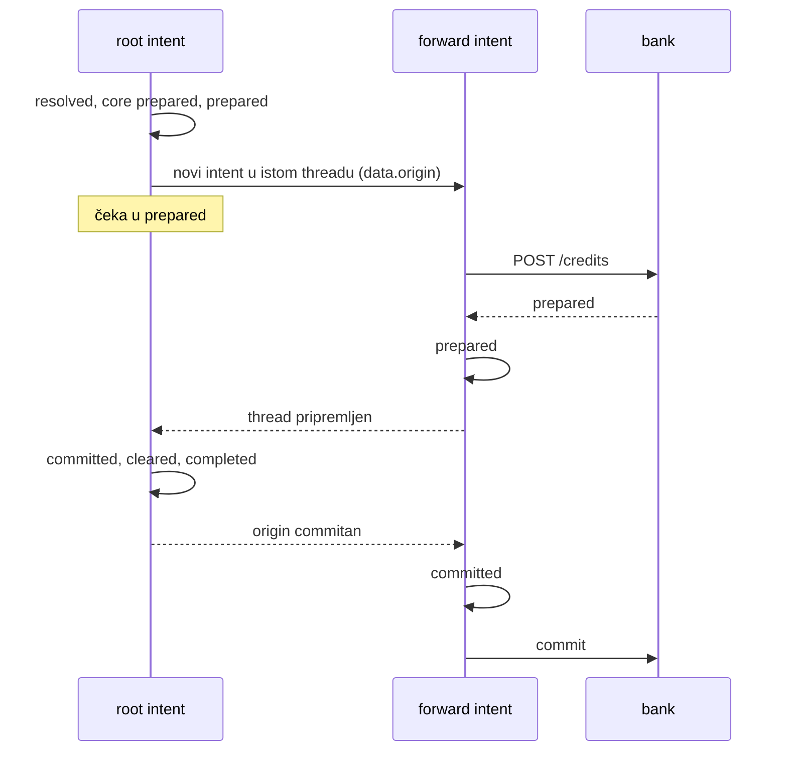

# Nastanak L7 i dalje — 2026-10-02, četvrta sesija

Nastavak [`2026-09-26-nastanak-e2e-l6-l8.md`](2026-09-26-nastanak-e2e-l6-l8.md).
Ponašanje reference je u [`FINDINGS.md`](../FINDINGS.md), plan u [`TODO.md`](../TODO.md).
Ovo je prva sesija vođena iz ovog repoa, a ne iz `../docs.minka.io`. Svaka razina
ima svoje poglavlje, a tablica „Gdje smo“ na kraju opisuje stanje nakon zadnje.

## L7 — threadovi, istek threada, ograničenje veličine

### Što je napravljeno

- **Thread se commita kao cjelina.** Intent koji je napravio `forward` čeka u
  `meta.status: prepared` (i s `routed`) dok svaki intent threada nije pripremljen.
  Root commita prvi, a svaki forward intent nakon intenta koji ga je napravio.
- **Thread i pada kao cjelina.** Kad jedan intent padne, ostali dobivaju isti
  `failed {reason, detail}`, zatim `aborted` i otpuštanje rezervacija (core `aborted`
  po unosu), abort bridgeova kojima je poslan prepare, i `rejected`. To vrijedi za
  odbijen forward, za bridge koji odbije prepare i za istek.
- **Popravak koji je otkrila snimka:** forward intent s bridgeanim dijelom slao je
  prepare iznova na svaki izvještaj. Marker „prepare je krenuo“ bili su core proofovi,
  a forward intent ih nema. Sad ga zamjenjuje oznaka (`Store.once`, novi `Store.marked`).
- **Debit forward intenta ne provjerava saldo.** Troši kredit svog threada koji je
  pripremljen, ali još nije commitan. Wallet je u tom trenutku prazan, a referenca ga
  propušta.
- Scenarij `l7` (33/36 i 12/15, ostatak su namjerne razlike), 5 unit testova u
  `server/test/l7.test.ts`.

### Metoda

Kao i prije, ali s jednim novim pravilom, naučenim na teži način: **prije snimanja
pitaj može li slučaj napraviti neograničen posao na referenci.** Prva snimka imala je
dva walleta koji si međusobno prosljeđuju. Referenca ograničenje od 10 intenata
provjerava tek kad je thread pripremljen, pa je u devet minuta napravila oko 5000
intenata na Minkinom stagingu. Petlju sam prekinuo izmjenom ruta tih dvaju walleta, što
je dopuštalo pravilo `{any, any}` testnog ledgera. Tek tada je referenca javila
`core.thread-size-exceeded`. Takvi slučajevi idu samo u unit testove (zapisano i u memory).

Ishod „tihog“ forwarda i petlje pročitan je izravno sa sandboxa (`curl`, bez proxyja).
U snimci je samo ograničena verzija.

### Odluke

- **Ograničenje veličine provjerava se pri prosljeđivanju.** Intent čiji bi forward
  napravio 11. intent u threadu pada s reasonom i detailom reference. Ovo je namjerno
  odstupanje, jer referenca petlju prvo pusti.
- **Istek forward intenta.** Referenca ga ne istekne ni nakon devet minuta, pa thread
  ostaje zauvijek s rezerviranim novcem. Mi ga isteknemo, a thread pada s
  `core.intent-expired`. Odstupanje je u `divergences.json` (l7 #25–27, bridge #12–14),
  jer dokumentacija kaže da istek abortira cijeli thread.
- **Thread se traži skeniranjem intenata ledgera,** ali samo za threadove s forwardom
  (oznaka `thread … forwarded`). Ostali intenti ne plaćaju ništa. Indeks po
  `meta.thread` je u TODO-u.
- **`routed` dok čeka:** uvijek. Referenca ga ima ili nema ovisno o utrci (dvije
  snimke, dva ishoda).

### Zamke

1. **Neograničen scenarij na referenci** (vidi Metoda). Ponovna snimka koštala je još
   dva ledgera na sandboxu.
2. **Slučaj koji kod nas istekne za sekundu, a na referenci nikad,** pomaknuo je sve
   iza sebe (bridge log, numeraciju coreId-a). Zato je premješten na kraj scenarija.
3. **Comparator:** id intenta upisan u tekst (`… for intent 04VC…`) i u URL statusnog
   PUT-a sad se normalizira. Razmjena koja postoji samo na jednoj strani može biti
   namjerna razlika. Izvještaji istog bridgea s istim statusom slažu se po mjestu unosa
   u trailu, a `core-N` testnog bridgea više nije identitet. Bez toga je `l6` na
   Postgresu pukao na utrci koju je otkrila sporija obrada.
4. **`settle` u scenariju koji `aborted` smatra konačnim** pročitao bi intent prije
   nego što bridge potvrdi abort. Polling ide mimo proxyja, pa popravak ne mijenja
   fixture.
