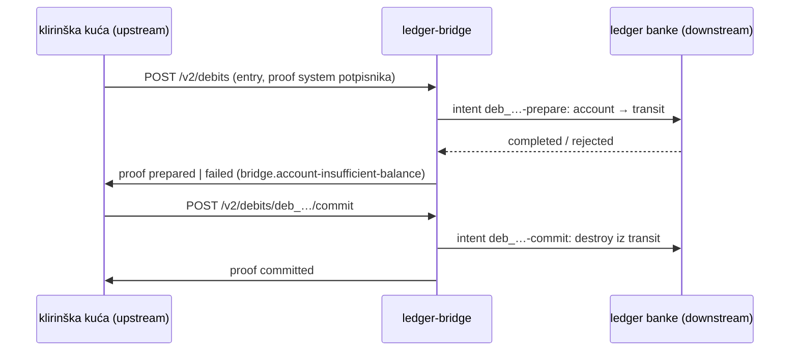

# Nastanak L9 cross-ledger — 2026-10-10, sesija S6

Nastavak [`2026-10-10-nastanak-usmjeravanje.md`](2026-10-10-nastanak-usmjeravanje.md).
Ponašanje reference je u [`FINDINGS.md`](../FINDINGS.md), plan u
[`2026-10-10-plan-do-paritete.md`](2026-10-10-plan-do-paritete.md).

## Model

`connecting-systems/cross-ledger-payments.md` zapravo ne spaja dva ledgera. Tutorial ima
jedan ledger u oblaku (klirinšku kuću), a banka je iza bridgea: `minka bridge start`
odgovara na prepare i commit. Dva ledgera postaju spojena tek kad je i jezgra banke
ledger, a bridge je adapter između njih. Klijentski API nema ništa što bi ledgere
povezalo izravno.

| Tko | Što potpisuje |
| --- | --- |
| klirinška kuća | entry u svakom 2PC pozivu (`system` signer); adapter po tom proofu odlučuje vjeruje li pozivu |
| ključ bridgea (`mint`) | proofove na intentu klirinške kuće (prepared/committed/aborted) i intente u ledgeru banke |
| operator | ledgere, zapise i financiranje |

**Zrcalo:** novac koji prelazi granicu se na jednoj strani uništi, a na drugoj izda. Zato
je ukupna ponuda u ledgeru banke uvijek jednaka saldu walleta `mint` kod klirinške kuće.
To je jedina invarijanta i provjerava se u svakom testu.

**Bez petlji:** adapter piše samo prema dolje, a ledger banke nema bridge. Svako čekanje je
ograničeno (240 × 250 ms).

## Što je napravljeno

- `bridges/ledger-bridge`: generički adapter ([README](../bridges/ledger-bridge/README.md)).
- Scenarij `l9`: dva ledgera na sandboxu. Snimljen jednom, i naš server se podudarao iz
  prve (40/40 + 51/51). U serveru nije trebalo ništa mijenjati.
- Scenarij `l9mixed`: isti adapter između sandboxa i našeg servera, u oba smjera
  (31/31 + 78/78). Prvo Minka radi kao klirinška kuća za ledger banke na našem serveru, a
  zatim naš server radi kao klirinška kuća za ledger banke na sandboxu. Oba smjera
  završavaju sa zrcalom 325 = 325. To je dokaz kompatibilnosti u README-u.
- `server/test/l9.test.ts`: dvije naše instance (memory i Postgres), 24 istovremena plaćanja
  u oba smjera, krivotvoreni poziv (401), entry nakon restarta.
- `compare.ts`: linije adaptera prema dolje (`downstream`) pripadaju entryju koji
  izvršavaju. Abortovi više entryja istog intenta uspoređuju se po entryju, a ne po
  redoslijedu dolaska.
- `footprint.ts`: scenarij koji radi više ledgera to kaže retkom
  `// footprint-ledger: <sufiks>`. Svaki dodatni ledger upisuje se kao zaseban run.
- `run.sh`: `needs-local-server` pokreće naš server i kod snimanja (za `l9mixed`).

## Nezgoda

Snimka `l9` je dovršena, ali `run.sh` je završio s `exit 127`. Mijenjao sam `run.sh` dok se
izvršavao, a bash skriptu čita dok je izvodi. Scenarij je prošao do kraja, a fixture je
cjelovit. Korak `own-ledger` pokrenut je ručno, a footprint ostaje sa `exit 127`, jer se
log samo dopisuje. **Pravilo: dok snimka radi, `conformance/run.sh` se ne dira.**

## Što ostaje (za kasnije, nije blokirajuće)

- Adapter drži pripremljene entryje u memoriji. Nakon restarta ih vadi iz intenta, ali
  run koji je bio u tijeku se gubi. Ledger tada ponavlja poziv, pa se on obnovi.
- Commit koji dolje ne uspije ni nakon 240 pokušaja samo se zapiše u log, za operatora.
  Protokol kaže da commit ne smije pasti. Trajni red za ponovne pokušaje je posao za
  produkciju, a ne za paritet.
- Simetrično spajanje (ledger banke šalje u klirinšku kuću preko drugog adaptera) nije
  potrebno: plaćanje iz banke pokreće se u klirinškoj kući adresom `account:…@mint`, kao
  u tutorialu.
