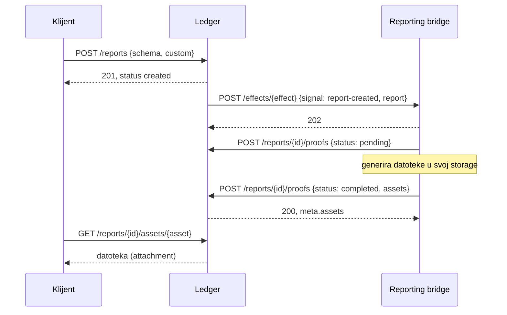

# Nastanak: reports (S3, 2026-10-10)

Sesija S3 iz lanca `docs/handoffs/`. Snimljeno na sandboxu 2.47.4 i reproducirano na
memory i Postgres storeu. Detalji ponašanja su u `FINDINGS.md`.

## Što je napravljeno

| Paket | Snimke | Rezultat |
| --- | --- | --- |
| `$rep` record (9 operacija), report sheme | `reports` 54 | 49/54, 5 namjerno drukčije |
| Reporting protokol: effect `report-created` → bridge → proofovi | `reports` bridge 14 | 13/14, 1 namjerno drukčiji |
| Tablica statusa (svih 25 parova), asseti | `reports2` 243 | 236/243, 7 namjerno drukčije |
| `minka report …` iz CLI-ja | — | 10 novih koraka u `scripts/cli-e2e.sh` |

Operacije: 132 → **141 od 146**, potvrđeno snimkom 101 → 110. Unit testova 327 → 341.
Dva nova ledgera na sandboxu, oba u `footprint.jsonl`.

## Protokol

Za reporte ne postoji poseban trait. Effect je generički, a bridge treba trait
`effects`. Docs spominju trait `reports`, ali ga shema bridgea odbija.

## Odluke

- **Neispravan asset vraća 422, a ne 500.** Referenca na krivi bucket, put ili ime
  datoteke odgovara s `500 api.unexpected-error`, a razlog je samo u stack traceu. Mi
  vraćamo `422 record.invalid` s njezinom porukom. Kod 500 bridge pokušava ponovo, a
  ovaj proof nikad ne može proći.
- **Bucket se konfigurira.** `OPEN_LEDGER_REPORTS_BUCKET` je bucket koji asseti moraju
  imati. Bez njega prolazi svaki. U checku ga `run.sh` postavlja na sandboxov
  `ledger-reports-stg`.
- **Datoteke su posao deploymenta.** Minka ih čita iz svog GCS-a, a mi iz
  `OPEN_LEDGER_REPORTS_DIR` (put objekta ispod direktorija). Nepoznat asset i datoteka
  koje nema daju 404. Referenca u prvom slučaju vraća 500, a u drugom joj pukne veza.
  BigQuery i BQRB izvoz su Minkini i nisu dio paritete.
- **Ponovljeni status je no-op**, kao na referenci: 200, proof se ne sprema, nema
  promjene ni eventa.
- Provjeravamo samo oblik puta asseta, a ne vrijednosti ledgera i luida u njemu. Je li
  referenca strože provjerava, nije snimljeno: to je `(?)` u `TODO.md`.

## Usput

- **Check je pao na početku sesije** (L6, „a bridge that never answers a prepare”).
  Nije bio flake. Trajna baza za unit testove narasla je na 3735 ledgera (422 MB), a
  `expire()` svakih 20 ms čita sve ledgere. `scripts/check.sh` sada unit testovima daje
  praznu bazu po runu (`dev-db.sh fresh open_ledger_test`).
- `conformance/bridge.ts`: `afterEffect` (bridge nakon eventa potpisuje proofove na
  reportu) i `files` (`GET /files/<ime>`).
- `conformance/compare.ts`: normalizira luid i unutar stringa, npr. u `gs://…/$rep.…/`.
- **Download asseta kojeg nema u bucketu ruši vezu na referenci** (503 s gatewaya,
  dvaput u `reports2`). To se ne snima ponovo.
